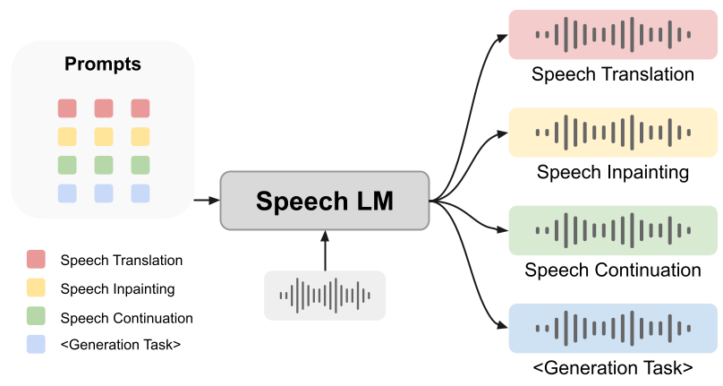
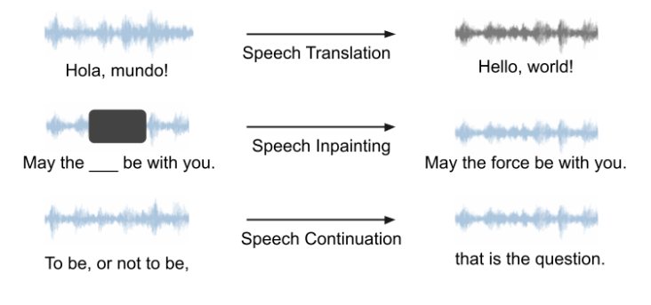

<h1> SpeechGen: Unlocking the Generative Power of Speech Language Models with Prompts</h1> 

> ### *Project Website*
> https://ga642381.github.io/SpeechPrompt/

* ***Title***: SpeechGen: Unlocking the Generative Power of Speech Language Models with Prompts
* ***Paper Link***: https://arxiv.org/abs/2306.02207
* ***Authors***: Haibin Wu*, Kai-Wei Chang*, Yuan-Kuei Wu*, Hung-yi Lee
* ***Comment***: Work in progress. The first three authors contributed equally
* ***Comment2***: [Haibin Wu](https://hbwu-ntu.github.io) is now in job hunting. Contact: f07921092@ntu.edu.tw

<p align="center">
  
<p/>


## Introduction
**Large language models (LLMs)** have gained considerable attention for Artificial Intelligence Generated Content (AIGC), particularly with the emergence of ChatGPT. However, the direct adaptation of continuous speech to LLMs that process discrete tokens remains an unsolved challenge, hindering the application of LLMs for speech generation. 

In this work, we present pioneering research that explores the application of prompt tuning to stimulate speech LMs for various generation tasks, within a unified framework called **SpeechGen**, with around **10M trainable parameters**. The tasks are all performed in a **textless** senario, without any text supervison, which distinguishes SpeechGen from other existing works. The proposed unified framework holds great promise for efficiency and effectiveness, particularly with the imminent arrival of advanced speech LMs, which will significantly enhance the capabilities of the framework.

## Keywords
* Speech Large Langauge Models (Speech LLMs)
* Speech Generation
* Prompting
* Textless

## Demo
Please refer to: https://ga642381.github.io/SpeechPrompt/speechgen for demos, including **speech translation**, **speech inpainting**, and **speech continuation**. All the tasks are performed in speech-to-speech manner, without any text supervision.

<p align="center">
  
</p>

## Citation
If you find SpeechGen insightful, please consider cite our work using the following BibTex:

```
@article{wu2023speechgen,
  title={SpeechGen: Unlocking the Generative Power of Speech Language Models with Prompts},
  author={Wu, Haibin and Chang, Kai-Wei and Wu, Yuan-Kuei and Lee, Hung-yi},
  journal={arXiv preprint arXiv:2306.02207},
  year={2023}
}
```
